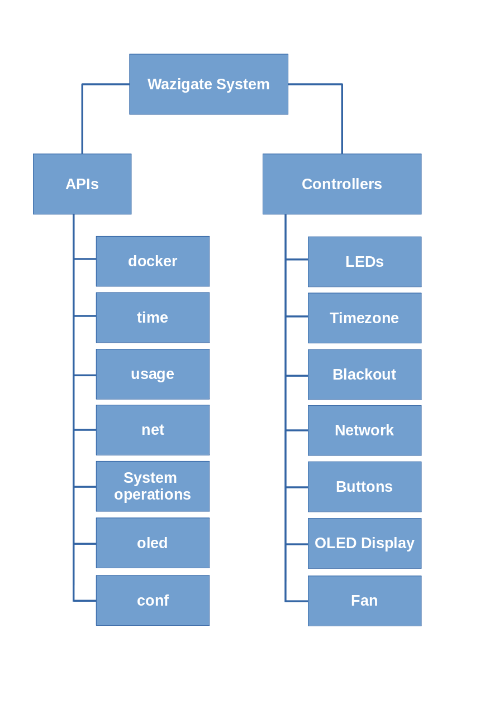

# Wazigate-System

The list of APIs can be found here: https://waziup.github.io/wazigate-system/

A useful link: https://github.com/Waziup/WaziGate/blob/master/docs/System.md
Source code documentation: https://pkg.go.dev/github.com/Waziup/wazigate-system

## System Architecture

Wazigate system composed of two main modules: _APIs_ and _Controllers_.

### APIs

`/api/routers.go` defines the API routes and the functions to be called for each of them.
For a better organization we group the related functions in relevant files which are listed below:

#### docker

This component takes care of all docker related APIs. Listed below:

- `/docker`
- `/docker/:cId`
- `/docker/:cId/:action`
- `/docker/:cId/:action`
- `/docker/:cId/logs`
- `/docker/:cId/logs/:tail`

To serve these APIs we are required to communicate the docker service running on the host.
Therefore, we have to either call docker APIs on its socket mapped to a file on the guest (wazigate-system) container or run docker shell commands on the host directly. In the current version of the code we call `execOnHost(cmd)` function which executes a given command on the host and returns the result.

#### time

---

## Status LED Indicator

The recent version of WaziGate has two status LEDs on board and `wazigate-system` indicates the connectivity status via those LEDs.

## LED 1

`LED 1` indicates the status of Internet connectivity and has two states:

- **Internet connectivity is ok**: it stays on: `_______________________________`
- **No Internet**: it blinks fast like this: `.............`

## LED 2

`LED 2` indicates the WiFi status and it has 3 states:

- **Access Point Mode**: this LED blinks slowly once a second: `__ __ __ __ __`
- **WiFi Client Mode Connected to a router**: it stays on: `_______________________________`
- **Trying to Connect**: it blinks fast like this with large off: `. . . . . . . . . . . . .`
- **Not Connected**: it blinks fast like this: `.............`
